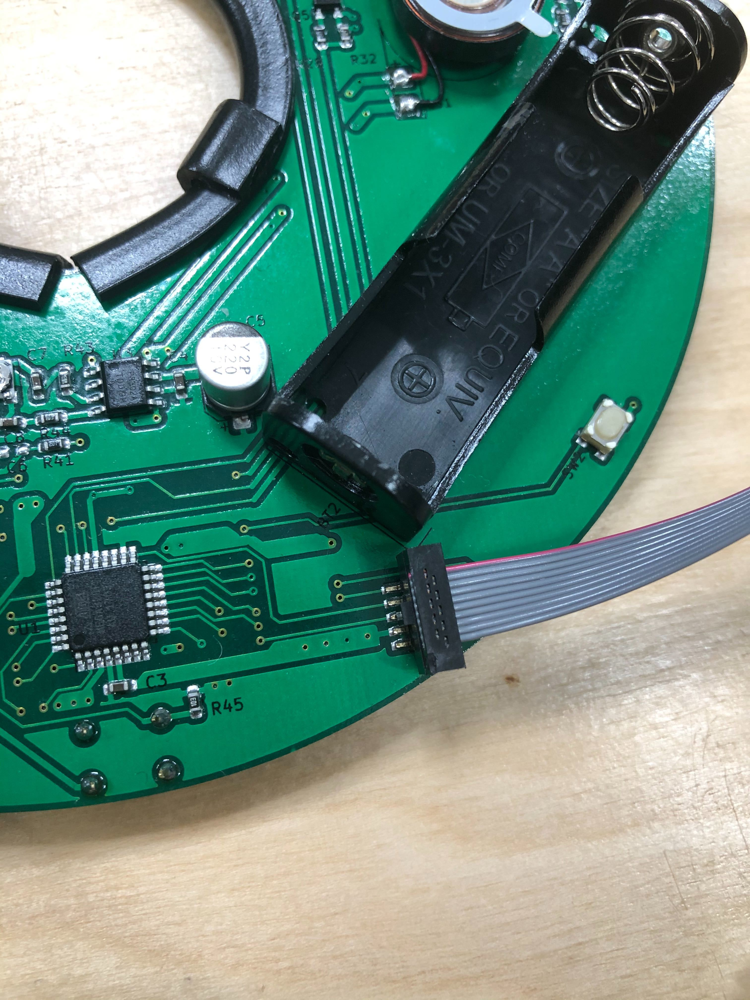
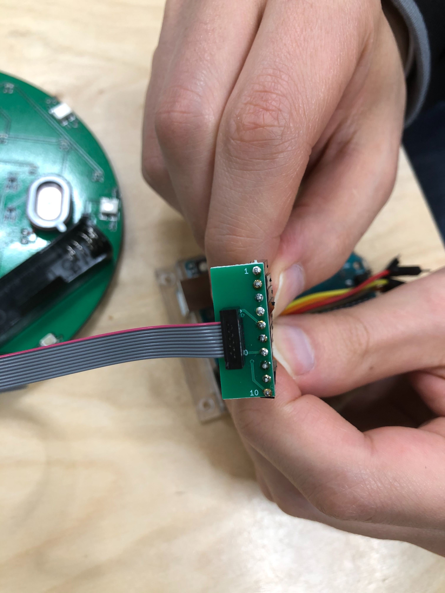
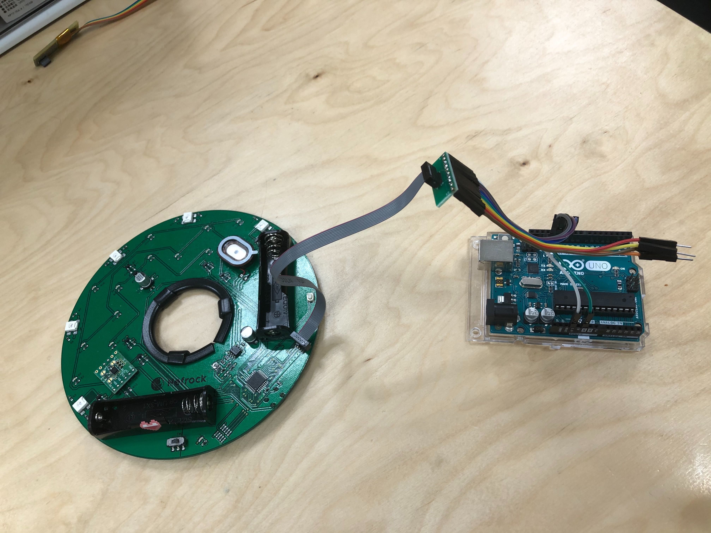
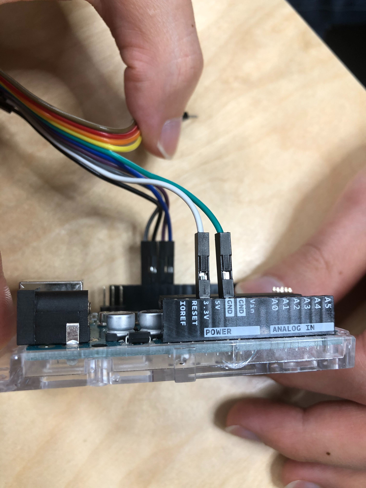
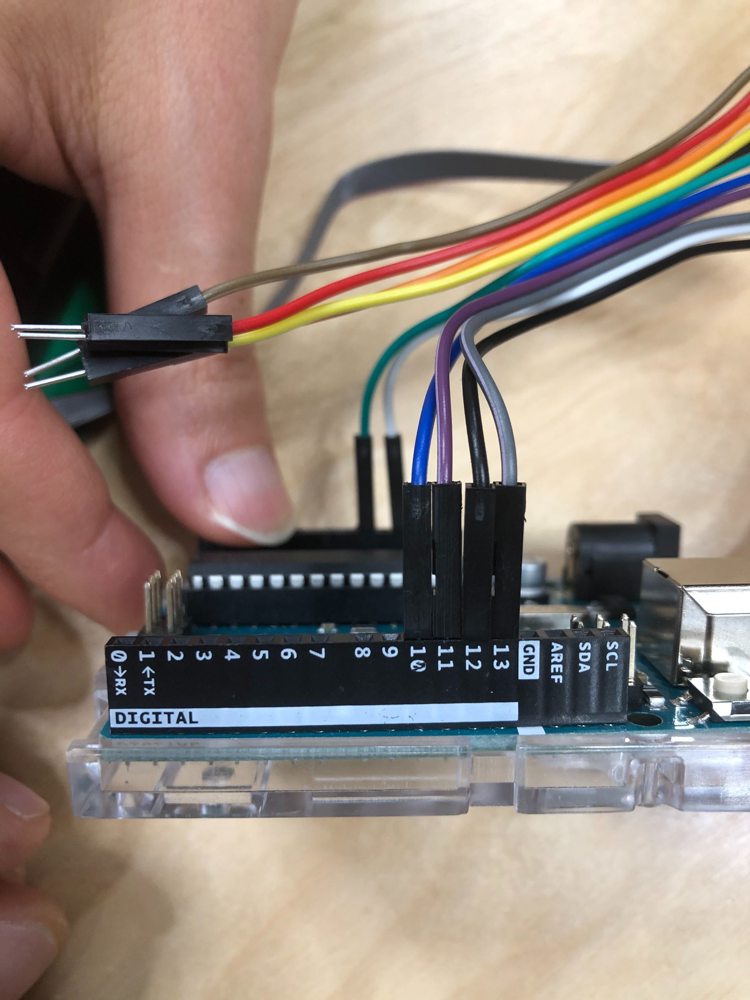

# 書き込み方法

Suika-Board の書き込みは Arduino を用いて行います。
具体的には、Arduino に ArduinoISP スケッチを書き込み、その Arduino をライターとして Suika-Board に書き込みを行います。  
説明で用いるのは Arduino UNO ですが、他の種類の Arduino を用いても書き込みは可能です。  
ArduinoISP の詳しい説明が知りたい方は[こちら](https://www.arduino.cc/en/tutorial/arduinoISP)を参照ください。  
なお、購入時の Suika-Board への Bootloader は、書き込み済みですので、Suika-Board への Bootloader の書き込みは不要です。

## 1. Arduino に ArduinoISP を書き込む (初回のみ)

1. Suika Board から電池を外す
1. Arduino アプリを以下からダウンロードしてインストール
   - https://www.arduino.cc/en/Main/Software
1. ボードファイルをダウンロード
   - https://www.arduino.cc/en/Tutorial/ArduinoToBreadboard から breadboard-1-6-x.zip をダウンロードし、解凍して以下に配置
   - ~/Document/Arduino/hardware/ (Mac)
   - C:/Program Files(x86)/Arduino/hardware/ (Win)
1. PC と Arduino を USB で繋ぐ
1. Arduino が起動している場合は一旦終了してから Arduino アプリを起動する
1. ArduinoISP のコード を開く
   - メニューバーのファイル=>スケッチ例=>11. ArduinoISP
1. 各種設定
   - メニューバーのツール=>ボード=>ArduinoGenuino Uno もしくは Arduino Uno
   - メニューバーのツール=>シリアルポート=>Arduino が接続されたポート
   - メニューバーのツール=>書き込み装置=>AVRISP mkII
1. 書き込み
   - メニューバーのスケッチ=>マイコンボードに書き込む

## 2. Suika-Board に Arduino を経由してプログラムを書き込む

1. Suika Board から電池を外す
1. PC から Arduino を"外す"
1. Suika-Board に Suika 書き込みケーブルを繋ぐ
   - 
   - 赤い線の位置に注意！！
1. Arduino にジャンパーを繋ぐ
   - 
   - 灰:13(SCK), 黒:12(MISO), 紫:11(MOSI), 青:10(SS), 白:3.3V, 緑:GND, 黄, オレンジ, 赤, 茶:未接続
1. PC と Arduino を USB で繋ぐ
1. src/suika_board/suika_board.ino ファイルを Arduino アプリで開く
1. pitches.h を編集して音楽を打ち込む
1. 設定 - メニューバーのツール=>ボード=>ATmega328 on a beradboard (8Mhz)
   - メニューバーのツール=>書き込み装置=>Arduino as ISP
   - メニューバーのツール=>シリアルポート=>Arduino が接続されたポート
1. 書き込み
   - メニューバーのスケッチ=>書き込み装置を使って書き込む (→ マークではないので注意)
